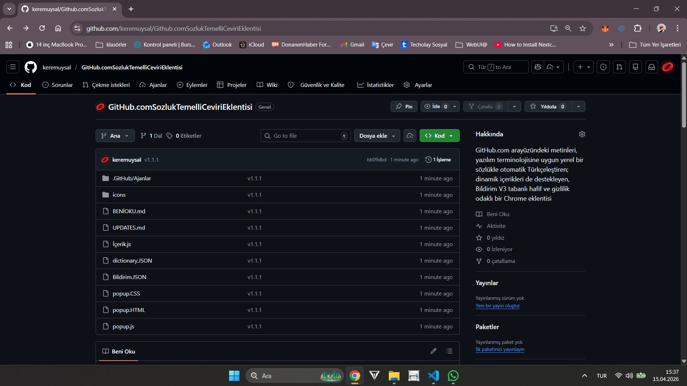
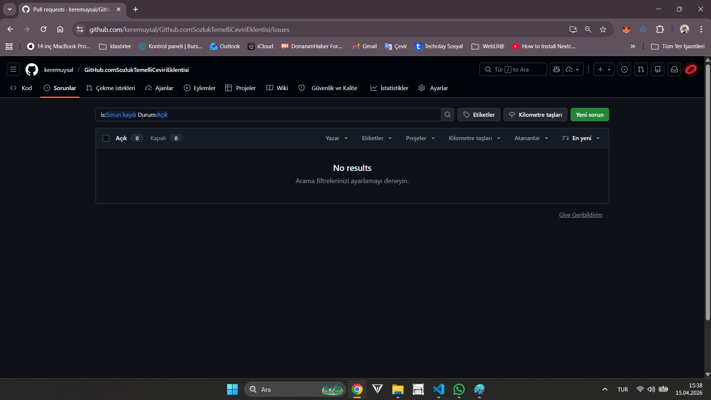

# GitHub.com Sözlük Temelli Çeviri Eklentisi

GitHub arayüzündeki metinleri yazılım terminolojisine uygun bir Türkçe sözlük ile çeviren Manifest V3 tabanlı Chrome eklentisi.

[](https://developer.chrome.com/docs/extensions/mv3/)
[](manifest.json)
[](https://github.com)
[](dictionary.json)
[](dictionary.json)

## Proje Özeti

- GitHub sayfalarını sözlük tabanlı olarak Türkçeleştirir.
- 3600'den fazla çeviri ve 200 binden fazla kelime kapsamı sunar.
- Kod bloklarına ve kritik etiketlere dokunmaz.
- Dinamik yüklenen içerikleri de çevirir.
- Popup üzerinden Aktif veya Pasif kontrolü vardır.
- Harici çeviri API'si kullanmaz.

## Temel Özellikler

- Sözlük tabanlı çeviri: Yerel dictionary.json dosyasından okunur.
- Güvenli metin tarama: TreeWalker ile yalnızca text node'lar işlenir.
- Dinamik içerik desteği: MutationObserver ile yeni eklenen alanlar çevrilir.
- Performans: Debounce ile toplu işleme yapılır.
- Stabilizasyon: Sonsuz döngü ve zincirleme metin büyümesine karşı node bazlı koruma vardır.

## Kurulum Geliştirici Modu

1. Chrome'da chrome://extensions sayfasını açın.
2. Sağ üstten Geliştirici modu seçeneğini aktif edin.
3. Paketlenmemiş öge yükle butonuna basın.
4. Bu proje klasörünü seçin.
5. github.com üzerinde herhangi bir repo sayfasını açın.

## Kullanım

1. Tarayıcı araç çubuğundan eklenti popup'unu açın.
2. Durum anahtarını Aktif veya Pasif olarak değiştirin.
3. Aktif olduğunda metin çevirisi otomatik uygulanır.
4. Pasif olduğunda çeviri işlemi durur.

## Proje Yapısı

```text
.
|- manifest.json
|- content.js
|- dictionary.json
|- popup.html
|- popup.css
|- popup.js
|- UPDATES.md
|- README.md
`- icons/
```

## Ekran Görüntüleri

### Repo Ana Sayfası



### Sorunlar Sayfası



## Teknik Akış

1. [content.js](content.js) açılır ve [dictionary.json](dictionary.json) yüklenir.
2. Sözlük girdileri uzunluğa göre sıralanır ve regex deseni hazırlanır.
3. TreeWalker ile görünen text node'lar toplanır.
4. Eşleşen terimler Türkçe karşılıklarıyla değiştirilir.
5. MutationObserver yeni node'ları yakalar ve çeviri sürecini tekrar çalıştırır.

## Sözlüğü Güncelleme

Yeni terim eklemek için [dictionary.json](dictionary.json) dosyasına key-value girişi ekleyin:

```json
{
  "Pull requests": "Değişiklik İstekleri",
  "Repository": "Depo"
}
```

Notlar:

- Büyük/küçük harf varyasyonları gerekiyorsa ayrı anahtar olarak ekleyin.
- Çok kelimeli terimler desteklenir.
- Çeviri kalitesi sözlük kapsamına bağlıdır.

## Gizlilik

- Harici çeviri servisine veri gönderilmez.
- Tüm çeviri işlemi tarayıcı içinde yerel olarak yapılır.
- Yalnızca eklenti durumu (aktif/pasif) chrome.storage.local üzerinde saklanır.

## Bilinen Sınırlar

- Sözlükte olmayan metinler olduğu gibi kalır.
- Kod blokları, script/style alanları ve benzeri etiketler bilerek çevrilmez.

## Sürüm

- Güncel sürüm: 1.1.2
- Değişiklik geçmişi: [UPDATES.md](UPDATES.md)

## İletişim ve Profil

- GitHub profil: [github.com/keremuysal](https://github.com/keremuysal)
- Geri bildirim ve öneriler için issue/PR açabilirsiniz.
